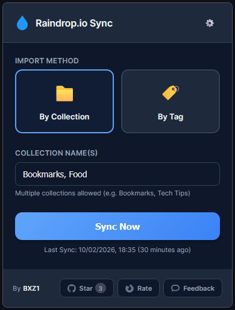
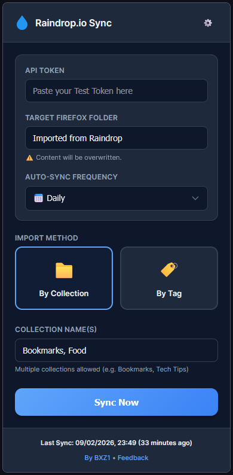
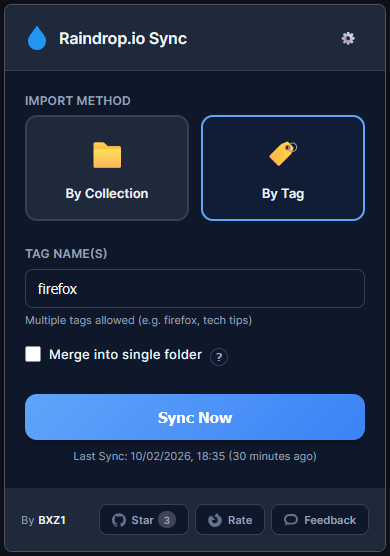

# Raindrop.io Sync for Firefox

**Bring your Raindrop.io bookmarks/collections directly into your native Firefox Bookmarks Toolbar.**  
Raindrop.io Sync is a specialized Firefox extension that bridges the gap between your cloud bookmarks and your native browser experience.

## 🖼️ Screenshots

  
  
  

## Features 🚀

Most bookmark managers keep your links tucked away in a separate app. This extension puts them exactly where you need them: **the native Firefox Bookmarks Toolbar.**

*   **Set and Forget**: Scheduled **Auto-Sync** keeps your toolbar fresh every few hours, daily, or weekly.
*   **Source Selection**: Sync multiple **Collections** or **#tags** at once (separated by commas).
*   **Respects Manual Order**: Perfectly mirrors your **manual sorting** and folder structure from Raindrop.
*   **Optional Flattening**: Choose to import everything into a single folder or preserve subfolders.
*   **Offline Reliability**: Won't touch your bookmarks if the API is down or you're offline.
*   **Privacy**: Open source, **zero data collection**, and local token storage.

## Installation ⚙️

1.  **Install**: Get the official extension from the [Firefox Add-ons Store](https://addons.mozilla.org/en-US/firefox/addon/raindrop-sync-firefox/).
2.  **Get your Token**:
    *   Go to [Raindrop.io Settings > Integrations](https://app.raindrop.io/settings/integrations).
    *   Scroll down to **"For Developers"** and click **"+ Create new app"**.
    *   Give it any name (e.g., `Firefox Sync`) and save.
    *   Click on your new app, then click **"Create test token"**.
    *   Copy the token and paste it into the extension's **API Token** field.
3.  **Pick your Source**: Select the **By Collection** or **By Tag** method. You can enter multiple names separated by commas (e.g., `Work, News, Tech Tips`).
4.  **Set the Target**: Choose which folder in your **Bookmarks Toolbar** should hold the synced links (Default: `Imported from Raindrop`).
5.  **Schedule Sync**: Choose your frequency and let the background script do the work.

## Development 🛠️

To load the extension for development:
1.  Clone this repository.
2.  Open Firefox and go to `about:debugging`.
3.  Click **"This Firefox"** -> **"Load Temporary Add-on..."**.
4.  Select `manifest.json`.

<i>Not affiliated with Raindrop.io. Built for the community.</i>

